<div align="center">

<!-- Dynamic Multi-line Greeting -->


<p align="center">
  
  
</p>

</div>

---

### 👩‍💻 About Me

```python
class NadaMesbah:
    def __init__(self):
        self.username = "NadaMesbah"
        self.location = "Morocco 🇲🇦"
        self.role = "Full-Stack Developer"
        self.languages = ["Python", "JavaScript", "TypeScript", "Java", "C++"]
        self.current_focus = "Building scalable web solutions"
        self.passion = "Clean code & innovative problem-solving"
        
    def say_hi(self):
        print("Thanks for dropping by! Let's build something amazing together! 🚀")

me = NadaMesbah()
me.say_hi()
```

- 🚀 Currently working on **exciting full-stack projects**
- 💡 Exploring **modern web architectures** and **AWS cloud technologies**
- 📧 Reach me at **nadamesbah2003@gmail.com**
- ⚡ Always eager to collaborate on **open-source projects**

---

### 🛠️ Tech Stack

<details open>
<summary><b>Languages</b></summary>
<br>
<p align="center">
  
</p>
</details>

<details open>
<summary><b>Frontend Development</b></summary>
<br>
<p align="center">
  
</p>
</details>

<details open>
<summary><b>Backend Development</b></summary>
<br>
<p align="center">
  
</p>
</details>

<details open>
<summary><b>Mobile Development</b></summary>
<br>
<p align="center">
  
</p>
</details>

<details open>
<summary><b>Databases & Tools</b></summary>
<br>
<p align="center">
  
</p>
</details>

<details open>
<summary><b>DevOps & Cloud</b></summary>
<br>
<p align="center">
  
</p>
</details>

---

### 📊 Developer Metrics Dashboard

<p align="center">
  
</p>

---

### 🐍 Contribution Snake

<p align="center">
  
</p>

---

### 🚀 Featured Projects

<table>
<tr>
<td width="50%">

#### 🎯 Project Name 1
Brief description of what this project does and why it's cool. Focus on the value it provides.

**Tech Stack:** `React` `Node.js` `MongoDB`

[](https://github.com/NadaMesbah/project-name)
[](#)

</td>
<td width="50%">

#### 🎯 Project Name 2
Brief description of what this project does and why it's cool. Focus on the value it provides.

**Tech Stack:** `Next.js` `Django` `PostgreSQL`

[](https://github.com/NadaMesbah/project-name)
[](#)

</td>
</tr>

<tr>
<td width="50%">

#### 🎯 Project Name 3
Brief description of what this project does and why it's cool. Focus on the value it provides.

**Tech Stack:** `Android` `Kotlin` `Firebase`

[](https://github.com/NadaMesbah/project-name)
[](#)

</td>
<td width="50%">

#### 🎯 Project Name 4
Brief description of what this project does and why it's cool. Focus on the value it provides.

**Tech Stack:** `Spring Boot` `React` `AWS`

[](https://github.com/NadaMesbah/project-name)
[](#)

</td>
</tr>
</table>

---

### 🤝 Connect With Me

<p align="center">
  <a href="https://www.linkedin.com/in/nada-mesbah-132068266/">
    
  </a>
  <a href="https://twitter.com/ivy_lecter">
    
  </a>
  <a href="https://discord.gg/#1687">
    
  </a>
  <a href="mailto:nadamesbah2003@gmail.com">
    
  </a>
</p>

---

<div align="center">
  


</div>
